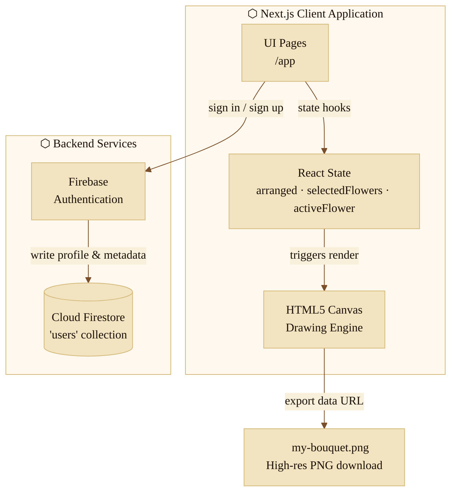

# Floravo — AI Bouquet Builder & Atelier

> *"Craft arrangements of singular beauty, as if composed by Nature's own hand."*
> Est. Pollachi, Tamil Nadu — MMXXIV

Floravo is an inventory-based bouquet creation platform. Users pick and arrange standardized flat-vector flower assets on a canvas. An intelligent positioning engine handles layering and spacing across predefined anchor points to produce natural-looking compositions. The interface is built around a **Vintage British Postal & Correspondence** theme — parchment textures, sepia ink, typewriter fonts.

---

## Table of Contents

- [Design System](#design-system)
- [Architecture](#architecture)
- [User Workflow](#user-workflow)
- [Layer & Anchor System](#layer--anchor-system)
- [Features](#features)
- [Project Structure](#project-structure)
- [Setup & Development](#setup--development)

---

## Design System

The UI avoids modern flat defaults in favor of a warm, typography-driven atelier aesthetic.

**Color palette:**

| Role | Value |
|---|---|
| Parchment (base) | `#f9f0dc` |
| Parchment (mid) | `#f2e4c0` |
| Parchment (deep) | `#d4b97a` |
| Ink (dark) | `#1a0f07` |
| Ink (sepia) | `#7a4f2a` |
| Accent red | `#c0392b` |

**Typefaces** (Google Fonts):

| Role | Font |
|---|---|
| Display / Headers | Playfair Display |
| Body / Reading | Crimson Text |
| Buttons / Canvas / Inputs | Special Elite |
| Taglines / Signatures | IM Fell English (italic) |

**Micro-interactions:** vintage postmarks, cancellation overlays, wax seals, letter-card frames with scale transitions.

---

## Architecture



**Stack:**

| Layer | Technology |
|---|---|
| Framework | Next.js 14.2.5 (App Router, CSR for builder) |
| UI | React 18 |
| Auth & DB | Firebase 10.12.2 (Auth + Cloud Firestore) |
| Styling | Vanilla CSS with CSS custom properties (`globals.css`) |

---

## User Workflow

```
Open Floravo
    │
    ▼
Signed in? ──No──► Envelope login/register card
    │                       │
    │               Firebase Auth
    │                       │
    │               Write profile to Firestore
    │                       │
   Yes◄────────────────────┘
    │
    ▼
Select up to 15 flowers from inventory
    │
    ▼
Pick background greenery
    │
    ▼
Auto Arrange / Shuffle
(compute anchors + jitter → render canvas)
    │
    ▼
Manual fine-tuning
(drag, resize, rotate, layer shift)
    │
    ▼
Step 2 — Personalize
Write note card (Dear / Message / Sender)
Optional: upload polaroid image
    │
    ▼
Step 3 — Review & Export
Compile canvas layers → download my-bouquet.png
```

---

## Layer & Anchor System

Floravo builds bouquets bottom-up across five layers. Positions are seeded from a fixed anchor database, then randomized via a jitter function to avoid rigid, templated placements.

### Z-index stack (back → front)

| Layer | Contents | Notes |
|---|---|---|
| 0 | Greenery background | Single asset, centered, `scale ~1.55` |
| 1 | Seam fillers | Baby's Breath or Eucalyptus — chosen by engine based on flower selection |
| 2–3 | Secondary flowers | Dome arrangement; Tulips, Carnations, Gerberas, Hydrangeas |
| 4–5 | Primary / hero flowers | 6 focal anchors; Roses, Sunflowers, Peonies, Lilies |

### Anchor counts

- **Layer 0:** 1 anchor at `{x: 280, y: 360, scale: 1.55}`
- **Layer 1:** 8 anchors
- **Layers 2–3:** 10 anchors
- **Layers 4–5:** 6 anchors

### Jitter function

```js
function jitter(anchor, jx = 18, jy = 14, jr = 10, js = 0.06) {
  return {
    x:        anchor.x        + (Math.random() - 0.5) * jx,
    y:        anchor.y        + (Math.random() - 0.5) * jy,
    rotation: anchor.rotation + (Math.random() - 0.5) * jr,
    scale:    Math.max(0.7, anchor.scale + (Math.random() - 0.5) * js),
    layer:    anchor.layer,
  };
}
```

Called on every auto-arrange or shuffle. Keeps compositions feeling hand-placed rather than grid-snapped.

---

## Features

### Interactive canvas sandbox

Selecting a flower on the canvas shows a golden dashed outline and exposes these controls:

- **Drag-and-drop** — mouse position maps directly to canvas coordinates
- **Rotation** — ±15° increments
- **Scale** — grow / shrink with modifier controls
- **Depth (Z-order)** — push forward or back in the render stack

### Envelope card personalization

- Fields: `Recipient`, `Sender`, freeform message (120-char max)
- Polaroid upload — renders inside a white frame, pinned to canvas corner

### Canvas export

Export triggers a programmatic offscreen redraw:

1. Fill background `#f9f0dc`
2. Overlay `bg_abstract.png` at 50% opacity
3. Iterate sorted layout array — draw each flower at its `(x, y)`, rotation, scale
4. Render note card at `−4°` with drop-shadow
5. Render polaroid at `+8°` with vintage filter pass (sepia, contrast, brightness)
6. Trigger download → `my-bouquet.png`

---

## Project Structure

```
present_app/
└── bouquet-app/                        # Next.js app root
    ├── app/
    │   ├── builder/
    │   │   └── page.js                 # Canvas builder & sandbox
    │   ├── globals.css                 # Design system tokens & theme
    │   ├── layout.js                   # Root layout
    │   └── page.js                     # Login / register landing page
    ├── lib/
    │   ├── auth.js                     # Firebase signup/login helpers
    │   └── firebase.js                 # Firebase SDK re-export
    ├── public/
    │   └── flowers/                    # Vector flower assets
    ├── firebase.js                     # Firebase config & initializer
    ├── flower-c41bd-firebase-adminsdk-fbsvc-18d9a7cbfe.json  # Admin service account (do not commit)
    ├── placement_algorithm.md          # Anchor math documentation
    ├── bouquet_workflow.md             # Product requirements & workflow notes
    ├── next.config.js
    ├── package.json
    └── .env.local                      # Local secrets — gitignored
```

---

## Setup & Development

### Prerequisites

- Node.js v18+
- npm v9+
- A Firebase project (Auth + Firestore enabled)

### Environment

Create `.env.local` inside `bouquet-app/`:

```ini
NEXT_PUBLIC_FIREBASE_API_KEY=
NEXT_PUBLIC_FIREBASE_AUTH_DOMAIN=
NEXT_PUBLIC_FIREBASE_PROJECT_ID=
NEXT_PUBLIC_FIREBASE_STORAGE_BUCKET=
NEXT_PUBLIC_FIREBASE_MESSAGING_SENDER_ID=
NEXT_PUBLIC_FIREBASE_APP_ID=
NEXT_PUBLIC_FIREBASE_MEASUREMENT_ID=
```

### Install & run

```bash
cd bouquet-app
npm install
npm run dev
```

Open [http://localhost:3000](http://localhost:3000).
