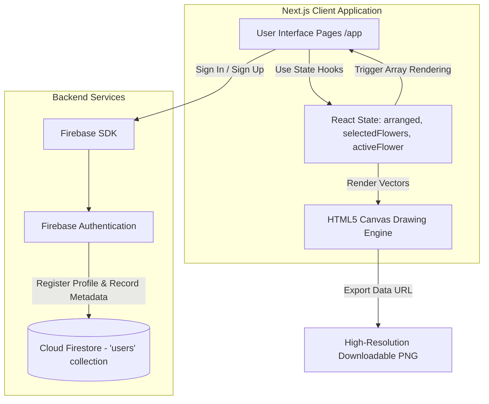
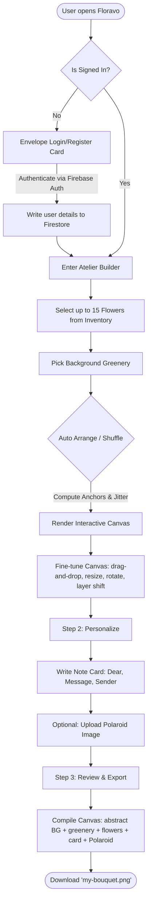
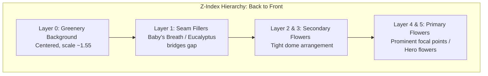

# Floravo — AI Bouquet Builder & Atelier

> **"Craft arrangements of singular beauty, as if composed by Nature's own hand."**  
> *Est. Pollachi, Tamil Nadu — MMXXIV*

Floravo is an inventory-based bouquet creation platform where users select, customize, and arrange standardized flat-vector flower assets. The application features an intelligent positioning engine that coordinates layering and spacing on predefined anchor points to produce natural-looking bouquets. Built on a **Vintage British Postal & Correspondence Theme**, the interface delivers an immersive tactile experience reminiscent of classical handwriting ateliers.

---

## 📖 Table of Contents
1. [Design Philosophy & Aesthetics](#-design-philosophy--aesthetics)
2. [Application Architecture](#-application-architecture)
3. [Core Workflows](#-core-workflows)
4. [The Layer & Anchor System](#-the-layer--anchor-system)
5. [Key Feature Details](#-key-feature-details)
6. [Repository Directory Structure](#-repository-directory-structure)
7. [Installation & Local Development](#-installation--local-development)

---

## 🎨 Design Philosophy & Aesthetics

Floravo steps away from modern generic flat styles to embrace a premium, rustic, and cozy typography-focused aesthetic:
- **Parchment Palette:** Features warm shades (`#f9f0dc`, `#f2e4c0`, `#d4b97a`) paired with deep sepia ink colors (`#1a0f07`, `#7a4f2a`) and Royal Mail Red accents (`#c0392b`).
- **Classic Typography:** Built using Google Fonts:
  - **Display:** *Playfair Display* for titles and headers.
  - **Body:** *Crimson Text* for reading text.
  - **Typewriter:** *Special Elite* for buttons, inputs, and canvas elements.
  - **Script:** *IM Fell English* (italic) for poetic taglines and signatures.
- **Micro-interactions:** Vintage postmarks, cancellation overlays, wax seals, and letter card frames with subtle scale transitions and animations.

---

## ⚙️ Application Architecture

The application is built on top of the modern React framework utilizing serverless utilities:



### Technology Stack
- **Framework:** Next.js 14.2.5 (App Router, Client-Side Rendering for the builder interactive canvas).
- **Core Library:** React 18.
- **Backend-as-a-Service:** Firebase 10.12.2 (Authentication for account lifecycle; Cloud Firestore for storing user data like creation logs, roles, and profiles).
- **Styling:** Custom Vanilla CSS Design System (`globals.css`) using CSS Custom Properties (Variables) for tokens.

---

## 🔄 Core Workflows

The user moves from accessing the atelier to exporting their personalized masterpiece in a clean four-step workflow:



---

## 📐 The Layer & Anchor System

To prevent messy, overlapping placements, Floravo utilizes a specialized coordinate placement algorithm. Every bouquet is built from the bottom up on precalculated anchor points with randomized natural jitter.



### The Anchor Database
- **Layer 0 (Background):** A single large greenery piece positioned at `{x: 280, y: 360, scale: 1.55}`.
- **Layer 1 (Seam Fillers):** 8 anchors bridging the background and midground. The engine automatically decides whether to inject **Baby's Breath** (for romantic flower choices like roses or peonies) or **Eucalyptus** (for wildflowers and sunflowers).
- **Layers 2–3 (Secondary):** 10 anchors arranged in a dome shape. Takes mid-sized flowers like Tulips, Carnations, Gerberas, and Hydrangeas.
- **Layers 4–5 (Primary):** 6 focal point anchors reserved for large hero elements (Roses, Sunflowers, Peonies, and Lilies).

### The Natural Jitter Algorithm
Positions are not rigid. Every auto-arrange or shuffle invokes a jitter function to simulate human composition:

```javascript
function jitter(anchor, jx = 18, jy = 14, jr = 10, js = 0.06) {
  return {
    x: anchor.x + (Math.random() - 0.5) * jx,
    y: anchor.y + (Math.random() - 0.5) * jy,
    rotation: anchor.rotation + (Math.random() - 0.5) * jr,
    scale: Math.max(0.7, anchor.scale + (Math.random() - 0.5) * js),
    layer: anchor.layer,
  };
}
```

---

## 🌟 Key Feature Details

### 1. Interactive Transformation Sandbox
When a flower is selected on the canvas, a golden dashed outline appears. Users can manipulate it with precision controls:
* **Drag-and-Drop:** Natural click-and-drag movements mapping mouse movements directly to the canvas elements.
* **Rotational Adjustments:** Increment or decrement rotation by 15-degree steps.
* **Scale Modifiers:** Grow or shrink flower sizing dynamically.
* **Depth Control (Forward/Back):** Shift flowers up or down in the Z-index rendering stack.

### 2. Envelope Card Personalization
Users write a typewritten note card directly on the screen. 
- Custom fields for `Recipient` and `Sender`.
- Maximum 120-character limit simulating spacing on real cards.
- Supports adding a polaroid photo via image upload, which renders inside a classic white Polaroid photo frame pinned to the corner of the canvas.

### 3. Canvas Export Engine
Clicking the export button triggers a programmatic redraw on an offscreen HTML5 canvas element:
1. Fills background with a soft cream `#f9f0dc` paper base.
2. Draws a subtle overlay of `bg_abstract.png` with 50% opacity.
3. Iterates through the sorted layout array, drawing each flower image translated to its `(x, y)` coordinate, rotated, and scaled.
4. Renders the custom typewritten note card at a tilted angle `-4°` with soft drop-shadows.
5. Renders the Polaroid photograph at a tilted angle `8°` with custom CSS-equivalent vintage filters (sepia, contrast, brightness).
6. Automatically triggers a download of a high-resolution PNG file (`my-bouquet.png`).

---

## 📁 Repository Directory Structure

```
present_app/
├── bouquet-app/                  # Next.js Application & Git Repository
│   ├── app/
│   │   ├── builder/
│   │   │   └── page.js           # Interactive Canvas Builder & Sandbox
│   │   ├── globals.css           # Global design system & theme styling
│   │   ├── layout.js             # Root layout configuration
│   │   └── page.js               # Envelope Login/Register landing page
│   ├── lib/
│   │   ├── auth.js               # Firebase signup/login helper actions
│   │   └── firebase.js           # Firebase Client SDK Initializer (re-exports root config)
│   ├── public/
│   │   └── flowers/              # Standardized vector assets (Roses, Tulips, etc.)
│   ├── firebase.js               # Primary Firebase Web SDK Config & Initializer
│   ├── flower-c41bd-firebase-adminsdk-fbsvc-18d9a7cbfe.json # Firebase Admin Service Account Credentials
│   ├── placement_algorithm.md    # Documentation of the flower arrangement math
│   ├── bouquet_workflow.md       # Product requirement documents & workflow draft
│   ├── README.md                 # Project documentation (this file)
│   ├── next.config.js
│   ├── package.json
│   └── .env.local                # Local environment secrets (ignored by Git)
└── assets/                       # Raw design elements (flower pngs)
```

---

## 🚀 Installation & Local Development

### Prerequisites
- Node.js (v18.x or later)
- npm (v9.x or later)
- Firebase Project setup

### Environment Setup
Create a `.env.local` file inside the `bouquet-app` directory and populate your Firebase client keys:

```ini
NEXT_PUBLIC_FIREBASE_API_KEY=your-api-key
NEXT_PUBLIC_FIREBASE_AUTH_DOMAIN=your-project-id.firebaseapp.com
NEXT_PUBLIC_FIREBASE_PROJECT_ID=your-project-id
NEXT_PUBLIC_FIREBASE_STORAGE_BUCKET=your-project-id.appspot.com
NEXT_PUBLIC_FIREBASE_MESSAGING_SENDER_ID=your-sender-id
NEXT_PUBLIC_FIREBASE_APP_ID=your-app-id
NEXT_PUBLIC_FIREBASE_MEASUREMENT_ID=your-measurement-id
```

### Installation
From the root workspace folder, navigate into `bouquet-app` and install dependencies:

```bash
cd bouquet-app
npm install
```

### Running Locally
Run the development server:

```bash
npm run dev
```

Open [http://localhost:3000](http://localhost:3000) with your browser to experience the Floravo Atelier.
