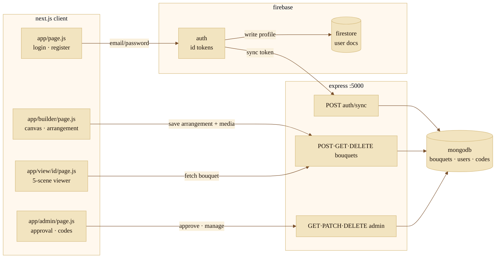
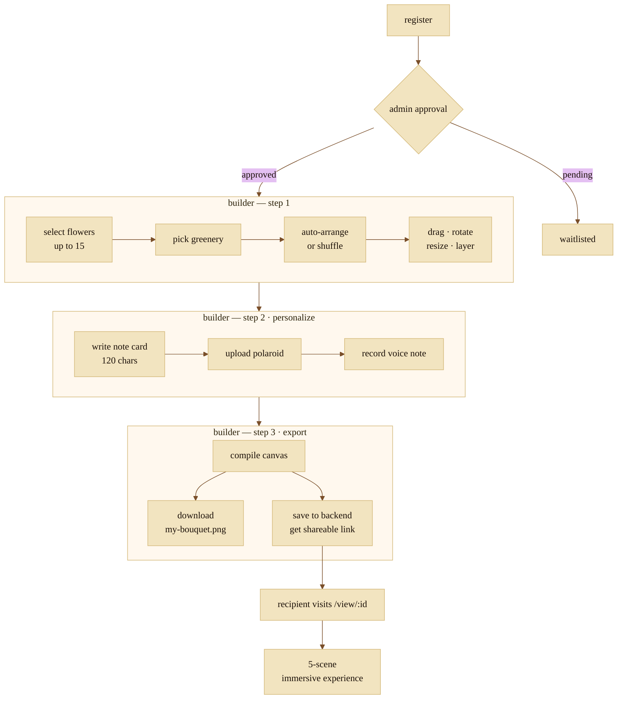

# floravo

> *"Craft arrangements of singular beauty, as if composed by Nature's own hand."*

Bouquet builder & gifting platform. Select flowers, arrange them on a canvas, write a note, record a voice message, and send a shareable link. Recipients get a 5-scene immersive unboxing. Built with a Victorian postal theme.

**Live →** https://floravo.vercel.app

---

## scope

```
next.js 14 (app router)  ·  react 18  ·  firebase auth + firestore
express backend (port 5000)  ·  mongodb  ·  html5 canvas
```

Two runtimes. The Next.js frontend handles the builder, viewer, and admin pages. The Express backend owns bouquet persistence, voice/media storage, and the user approval workflow. Firebase bridges auth between them — ID tokens issued at login are verified by the backend on every protected request.

---

## system map



---

## user path



---

## placement engine

Every arrangement is built bottom-up across 5 layers from a fixed anchor database. Positions are then randomized with a jitter pass so nothing looks grid-stamped.

| layer | content | anchors | notes |
|---|---|---|---|
| 0 | greenery background | 1 | centered, `scale 1.55` |
| 1 | seam fillers | 8 | baby's breath (romantic) or eucalyptus (wildflower) — engine decides |
| 2–3 | secondary flowers | 10 | dome arrangement — tulips, carnations, gerberas, hydrangeas |
| 4–5 | primary / hero | 6 | focal points — roses, sunflowers, peonies, lilies |

```js
// called on every arrange or shuffle
function jitter(anchor, jx = 18, jy = 14, jr = 10, js = 0.06) {
  return {
    x:        anchor.x        + (Math.random() - 0.5) * jx,
    y:        anchor.y        + (Math.random() - 0.5) * jy,
    rotation: anchor.rotation + (Math.random() - 0.5) * jr,
    scale:    Math.max(0.7, anchor.scale + (Math.random() - 0.5) * js),
    layer:    anchor.layer,
  };
}
```

---

## api surface

**auth**

| method | endpoint | description |
|---|---|---|
| `POST` | `/api/auth/sync` | sync firebase user → mongodb on login / signup |

**bouquets**

| method | endpoint | description |
|---|---|---|
| `POST` | `/api/bouquets` | save arrangement + base64 media (voice, polaroid) |
| `GET` | `/api/bouquets/:id` | fetch bouquet for viewer |
| `DELETE` | `/api/bouquets/:id` | delete user's bouquet |
| `POST` | `/api/feedback` | submit feedback, optionally linked to a bouquet |

**admin** *(requires admin role)*

| method | endpoint | description |
|---|---|---|
| `GET` | `/api/admin/pending-users` | fetch unapproved registrations |
| `PATCH` | `/api/admin/users/:id/approve` | approve user |
| `PATCH` | `/api/admin/users/:id/update` | update role / permissions |
| `DELETE` | `/api/admin/users/:id` | permanently delete user |
| `GET` | `/api/admin/all-users` | full user directory with search |
| `GET` | `/api/admin/invite-codes` | list active + claimed codes |
| `POST` | `/api/admin/invite-codes` | generate new code (custom or random) |
| `GET` | `/api/admin/metrics` | total users · pending · bouquets · codes |

---

## viewer experience

Five scenes play in sequence when a recipient opens `/view/:id`.

```
0  intro        floral particles · typewriter text
1  envelope     slides in · jiggles · recipient name
2  letter       note typed character-by-character with frame
3  vinyl         voice note plays on spinning vinyl record
4  bloom         flowers bloom back → front in sequence
5  final         bouquet + note card + polaroid + flower meanings + quote
```

---

## design system

**palette**

| token | value | use |
|---|---|---|
| parchment light | `#f9f0dc` | page background, canvas base |
| parchment mid | `#f2e4c0` | card surfaces |
| parchment deep | `#d4b97a` | borders, dividers |
| ink dark | `#1a0f07` | body text |
| ink brown | `#3b200a` | secondary text |
| sepia | `#7a4f2a` | labels, captions |
| postal red | `#c0392b` | accents, stamps |
| gold | `#b8860b` | selection outlines, wax seals |

**typefaces** — all Google Fonts

| role | font |
|---|---|
| display / headers | Playfair Display |
| body | Crimson Text |
| buttons · inputs · canvas | Special Elite |
| taglines · signatures | IM Fell English italic |

---

## project structure

```
bouquet-app/
├── app/
│   ├── page.js                   # login · register
│   ├── builder/page.js           # canvas builder
│   ├── view/[id]/page.js         # immersive viewer
│   ├── admin/pending-users/      # admin dashboard
│   └── globals.css               # design tokens
├── lib/
│   ├── auth.js                   # firebase helpers
│   └── firebase.js               # sdk init
├── public/flowers/               # vector assets
├── firebase.js                   # firebase config
├── .env.local                    # secrets — do not commit
└── package.json
```

> `flower-c41bd-firebase-adminsdk-*.json` — admin service account key. never commit this.

---

## local setup

**requirements** — Node 18+, npm 9+, Firebase project (Auth + Firestore), backend server on `:5000`

**.env.local**

```ini
NEXT_PUBLIC_FIREBASE_API_KEY=
NEXT_PUBLIC_FIREBASE_AUTH_DOMAIN=
NEXT_PUBLIC_FIREBASE_PROJECT_ID=
NEXT_PUBLIC_FIREBASE_STORAGE_BUCKET=
NEXT_PUBLIC_FIREBASE_MESSAGING_SENDER_ID=
NEXT_PUBLIC_FIREBASE_APP_ID=
NEXT_PUBLIC_FIREBASE_MEASUREMENT_ID=
NEXT_PUBLIC_API_URL=http://localhost:5000
```

**install & run**

```bash
cd bouquet-app
npm install
npm run dev
# → http://localhost:3000
```

Backend server (not in this repo) must be running on `:5000` for save/share/admin to work. Builder, viewer, and export are fully functional without it.

---

## status

| area | state |
|---|---|
| firebase auth | ✅ |
| bouquet builder + smart placement | ✅ |
| canvas export (PNG) | ✅ |
| save + shareable link | ✅ |
| immersive viewer (5 scenes) | ✅ |
| voice notes + polaroid | ✅ |
| admin dashboard | ✅ |
| backend server | ⚠️ not in this repo |
