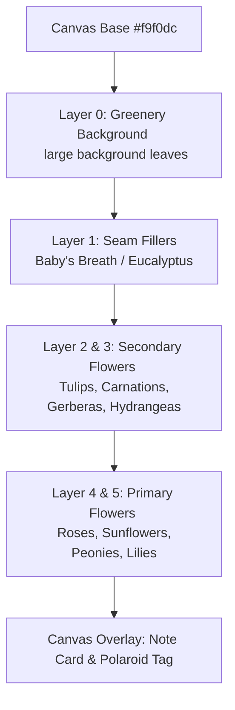

# Floravo Placement Engine — Arrangement Algorithm Documentation

This document provides a detailed breakdown of the mathematical, coordinate-based, and rule-based placement engine used in the **Floravo AI Bouquet Builder** application.

---

## 🧭 Architectural Objective
Rather than positioning flowers at completely random coordinates (which causes visual clutter, floating elements, or unnatural overlaps), Floravo implements a **Layered Anchor-Point System with Jitter Constraints**. This simulates the natural dome composition used by professional florists:

1. **Structural Dome:** Flowers form a cohesive, dome-like silhouette centered on the canvas.
2. **Visual Depth:** Greenery and filler stems sit in the background; medium flowers create bulk in the midground; hero/focal flowers rest in the foreground.
3. **Organic Jitter:** Small, bounded variations in position, scale, and rotation are applied so that every auto-arrange or shuffle yields a unique, natural-looking arrangement.

---

## 📊 The 6-Layer Rendering Stack

The canvas uses an HTML5 Canvas rendering engine and CSS stacking order sorting. Elements are sorted by their `layer` value (lowest layer number rendered first) to build the bouquet from back to front:



---

## 📍 Anchor Points Reference Table

The canvas size is normalized to **560px (Width) × 640px (Height)**. Below are the coordinate anchors for each layer category:

### 1. Layer 0 (Greenery Background)
Exactly **one** large background greenery image is centered and scaled up to establish the silhouette.
| Anchor ID | X | Y | Base Scale | Base Rotation | Layer |
| :--- | :---: | :---: | :---: | :---: | :---: |
| Background | 280 | 360 | 1.55 | 0° | 0 |

### 2. Layer 1 (Seam Fillers)
These anchors act as a structural bridge between the large background greenery and the mid-dome flowers.
| Index | X | Y | Base Scale | Base Rotation | Layer |
| :---: | :---: | :---: | :---: | :---: | :---: |
| 1 (Center) | 280 | 290 | 1.05 | 2° | 1 |
| 2 (Left) | 180 | 300 | 0.95 | -22° | 1 |
| 3 (Right) | 380 | 300 | 0.95 | 22° | 1 |
| 4 (Outer Left) | 120 | 270 | 0.88 | -42° | 1 |
| 5 (Outer Right) | 440 | 270 | 0.88 | 42° | 1 |
| 6 (Upper Left) | 230 | 230 | 0.82 | -15° | 1 |
| 7 (Upper Right) | 330 | 230 | 0.82 | 15° | 1 |
| 8 (Top Center) | 280 | 210 | 0.78 | 5° | 1 |

### 3. Layer 2 & 3 (Secondary Flowers)
Arranged in a tight circular cluster forming the main body of the bouquet.
| Index | X | Y | Base Scale | Base Rotation | Layer |
| :---: | :---: | :---: | :---: | :---: | :---: |
| 1 (Center Dome) | 280 | 240 | 0.98 | 0° | 3 |
| 2 (Left Mid) | 200 | 265 | 0.92 | -16° | 2 |
| 3 (Right Mid) | 360 | 265 | 0.92 | 16° | 2 |
| 4 (Left Upper Dome) | 235 | 205 | 0.88 | -10° | 3 |
| 5 (Right Upper Dome)| 325 | 205 | 0.88 | 10° | 3 |
| 6 (Outer Left Low) | 155 | 300 | 0.84 | -26° | 2 |
| 7 (Outer Right Low) | 405 | 300 | 0.84 | 26° | 2 |
| 8 (Lower Center) | 280 | 310 | 0.90 | 4° | 3 |
| 9 (Outer Left Top) | 210 | 165 | 0.80 | -18° | 2 |
| 10 (Outer Right Top)| 350 | 165 | 0.80 | 18° | 2 |

### 4. Layer 4 & 5 (Primary Hero Flowers)
Focal anchors placed at prominent, visible heights in the foreground.
| Index | X | Y | Base Scale | Base Rotation | Layer |
| :---: | :---: | :---: | :---: | :---: | :---: |
| 1 (Center Hero) | 280 | 218 | 1.10 | 0° | 5 |
| 2 (Left Focal) | 195 | 252 | 1.00 | -12° | 4 |
| 3 (Right Focal) | 365 | 252 | 1.00 | 12° | 4 |
| 4 (Lower Center) | 280 | 305 | 0.95 | 3° | 4 |
| 5 (Upper Left) | 225 | 172 | 0.90 | -20° | 4 |
| 6 (Upper Right) | 335 | 172 | 0.90 | 20° | 4 |

---

## ⚙️ Step-by-Step Algorithm Execution

When `generateArrangement` is triggered, the positioning engine performs these operations in order:

```mermaid
activityDiagram
    start
    :Receive selected flowers count list;
    :Step 1: Inject Background Greenery
    Apply minor jitter constraints to BG_ANCHOR;
    
    :Step 2: Detect Bouquet Theme
    Scan selection list for "romantic" flower IDs
    (Rose, Peony, Carnations, Pink Tulip);
    
    if (Romantic flower detected?) then (yes)
        :Choose Baby's Breath as seam filler;
    else (no)
        :Choose Eucalyptus as seam filler;
    endif
    
    :Step 3: Scatter Seam Fillers
    Shuffle the 8 SEAM_ANCHORS array
    Map filler to each anchor and apply jitter;
    
    :Step 4: Distribute Secondary Flowers
    Extract user-selected secondary flowers
    Shuffle the 10 SECONDARY_ANCHORS array
    Map secondary flowers (cycling anchors if count > 10)
    Apply secondary-specific jitter;
    
    :Step 5: Distribute Primary Flowers
    Extract user-selected primary flowers
    Shuffle the 6 PRIMARY_ANCHORS array
    Map primary flowers up to a maximum of 6 elements
    Apply primary-specific jitter;
    
    :Step 6: Final Sort
    Combine all arrays and sort elements by layer (Z-index ASC)
    Push array to canvas layout state;
    stop
```

---

## 🧮 The Jitter Function Mathematics

To prevent duplicate layouts from appearing identical, the `jitter` function applies a controlled, pseudorandom bounding offset to each anchor's properties:

```javascript
function jitter(anchor, jx = 18, jy = 14, jr = 10, js = 0.06) {
  return {
    x: anchor.x + (Math.random() - 0.5) * jx,
    y: anchor.y + (Math.random() - 0.5) * jy,
    rotation: anchor.rotation + (Math.random() - 0.5) * jr,
    scale: Math.max(0.7, anchor.scale + (Math.random() - 0.5) * js),
    layer: anchor.layer,
  };
}
```

### Parameter Explanations & Boundary Effects

$$\text{Position } X_{new} = X_{anchor} + (\text{random} - 0.5) \cdot jx$$
- **Effect:** Shakes the flower horizontally within a bounded range. For primary flowers ($jx = 14$), the coordinate shifts by up to $\pm 7\text{px}$. For secondary flowers ($jx = 20$), the coordinate shifts by up to $\pm 10\text{px}$.

$$\text{Position } Y_{new} = Y_{anchor} + (\text{random} - 0.5) \cdot jy$$
- **Effect:** Shakes the flower vertically. Capped up to $\pm 7\text{px}$ for secondary and $\pm 5\text{px}$ for primary layers to prevent separation from the stems.

$$\text{Rotation}_{new} = \text{Rotation}_{anchor} + (\text{random} - 0.5) \cdot jr$$
- **Effect:** Rotates the flower stem slightly off its anchor angle. Capped to $\pm 5^\circ$ for primary and $\pm 6^\circ$ for secondary/seam elements.

$$\text{Scale}_{new} = \max(0.7, \text{Scale}_{anchor} + (\text{random} - 0.5) \cdot js)$$
- **Effect:** Shrinks or enlarges the vector asset. By default, it fluctuates the sizing up to $\pm 3.5\%$ (primary) or $\pm 3\%$ (secondary), with a hard floor of $0.7$ times its base size to ensure visibility.

---

## 📝 Code Implementation Review

Below is the annotated logic implementation showing how inputs are filtered, mapped to anchors, and integrated:

```javascript
// app/builder/page.js

function generateArrangement(selectedFlowers, bgFile = 'greenery1.png') {
  const result = [];
  const ts = Date.now();

  // 1. BACKGROUND LAYER (Layer 0)
  const bgJitter = jitter(BG_ANCHOR, 10, 8, 4, 0.05);
  result.push({
    id: `bg-0-${ts}`,
    flower: { id: 'bg', name: 'Greenery', file: bgFile, category: '_bg' },
    ...bgJitter,
    isBg: true,
  });

  // 2. FILLER / SEAM LAYER (Layer 1)
  // Smart detection decides which filler visually matches the bouquet theme
  let usesRomanticFiller = selectedFlowers.some(f => 
    ['rose', 'penoy', 'carnation_red', 'carnation_pink', 'pink_tulip'].includes(f.flower.id)
  );
  let chosenFiller = usesRomanticFiller 
    ? SEAM_FILLERS.find(f => f.id === 'babys_breath') 
    : SEAM_FILLERS.find(f => f.id === 'eucaluptus');

  // Shuffle anchors to randomize which anchor point gets which jitter instance
  const seamAnchors = [...SEAM_ANCHORS].sort(() => Math.random() - 0.5);
  seamAnchors.forEach((a, i) => {
    const j = jitter(a, 16, 12, 12, 0.07);
    result.push({ id: `seam-${i}-${ts}`, flower: chosenFiller, ...j, isSeam: true });
  });

  // 3. SEPARATE FLOWER INPUTS INTO CATEGORIES
  const primaries   = [];
  const secondaries = [];
  selectedFlowers.forEach(({ flower, count }) => {
    if (flower.category === 'filler') return; // User-selected fillers are bypassed in favor of Layer 1 Auto-Placement
    for (let i = 0; i < count; i++) {
      if (flower.category === 'primary') primaries.push(flower);
      else secondaries.push(flower);
    }
  });

  // 4. MAP SECONDARY FLOWERS (Layers 2 & 3)
  const secAnchors = [...SECONDARY_ANCHORS].sort(() => Math.random() - 0.5);
  secondaries.forEach((flower, i) => {
    const a = secAnchors[i % secAnchors.length];
    result.push({ id: `sec-${flower.id}-${i}-${ts}`, flower, ...jitter(a, 20, 16, 12, 0.07) });
  });

  // 5. MAP PRIMARY FLOWERS (Layers 4 & 5)
  // Primary flowers are limited to the maximum number of focal anchors (6) to prevent overcrowding
  const priAnchors = [...PRIMARY_ANCHORS].sort(() => Math.random() - 0.5);
  primaries.slice(0, PRIMARY_ANCHORS.length).forEach((flower, i) => {
    result.push({ id: `pri-${flower.id}-${i}-${ts}`, flower, ...jitter(priAnchors[i], 14, 10, 8, 0.05) });
  });

  return result;
}
```
